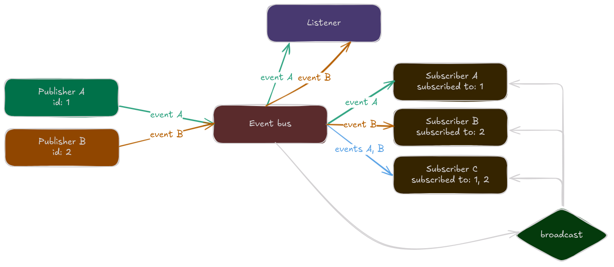

# LoveFlow
LoveFlow is an Event-Driven Architecture (EDA) implementation inside Love2d. LoveFlow allows for flexible customization of a message bus, controllable event handlers, publisher-subscriber systems and more.

# Installation
To install LoveFlow, follow this steps:

1. Clone or add as a submodule:
```bash
git clone https://github.com/Nykenik24/LoveFlow.git path/to/loveflow
# or
git submodule add https://github.com/Nykenik24/LoveFlow.git path/to/loveflow
```
2. Require loveflow
```lua
local loveflow = require("path.to.loveflow")
```

# Usage
After installing LoveFlow, you need to **create an architecture**:
```lua
local loveflow = require("loveflow")
local arch = loveflow.newArch()
```
Then create your publishers and subscribers
```lua
--...
local pub = arch.bus:newPublisher()
local sub = arch.bus:newSubscriber()
```
And finally update your architecture in `love.update`
```lua
function love.update(dt)
	arch:updateAll()
end	
```

Now you can publish events:
```lua
pub:publish("Hello, World!")
pub:publish({msg = "Hello, World!", some_var = 5})
```
Subscribe to publishers:
```lua
sub:subscribe(pub)
-- or
sub:subscribe(pub.id)
```
And handle events manually or with `subscriber:handleEvents`:
```lua
sub:handleEvents(arch.bus, function(self, event)
	--...
end)
-- or manually
local sub_events = sub:getEvents()
for id, event in pairs(sub_events) do
	--...
end	
```
You can also broadcast events through `bus:broadcast`
```lua
arch.bus:broadcast("DOOM!? Here in New York!?")
print(sub:getLastBroadcast(arch.bus))
```
## Nodes
Nodes in LoveFlow are:
- Publishers.
- Subscribers.
- Event buses.
- Listeners.

This section explains each one of them:
### Event bus *(or event broker)*
---
- Handles the event pool.
- Can broadcast events to all subscribers.
### Publisher
---
- Sends events. 
- Subscribers can suscribe to them to receive all published events.
### Subscriber
---
- Receives events.
- Can subscribe to publishers.
- Can get broadcasts.
### Listener
---
- Listens to events in an event bus.


<details>
<summary>Code</summary>

```lua
local loveflow = require("loveflow")
local arch = loveflow.newArch()

-- ## Create all nodes ## --
-- publishers --
local pub_a = arch.bus:newPublisher()
local pub_b = arch.bus:newPublisher()

-- subscribers --
local sub_a = arch.bus:newSubscriber():subscribe(pub_a)
local sub_b = arch.bus:newSubscriber():subscribe(pub_b)
local sub_c = arch.bus:newSubscriber():subscribe(pub_a):subscribe(pub_b)

-- listener --
local listener = arch.bus:newListener()

-- ## Publish and broadcast ## --
pub_a:publish("Event A")
pub_b:publish("Event B")
arch.bus:broadcast("broadcast")
```
</details>

# More about EDA
## What is EDA?
*[src: Geeks For Geeks article on EDA](https://www.geeksforgeeks.org/event-driven-architecture-system-design/)*

With event-driven architecture (EDA), various system components communicate with one another by generating, identifying, and reacting to events. These events can be important happenings, like user actions or changes in the system's state. In EDA, components are independent, meaning they can function without being tightly linked to one another. When an event takes place, a message is dispatched, prompting the relevant components to respond accordingly. This structure enhances flexibility, scalability, and real-time responsiveness in systems.


## Why is EDA useful?
Event-driven architecture inside your game allows for a very flexible game event system, allowing for modularity and control of internal game events.

LoveFlow implements a simple EDA system that allows to quickly setup publishers, subscribers, event handlers, etc. in a fast and easy manner.


